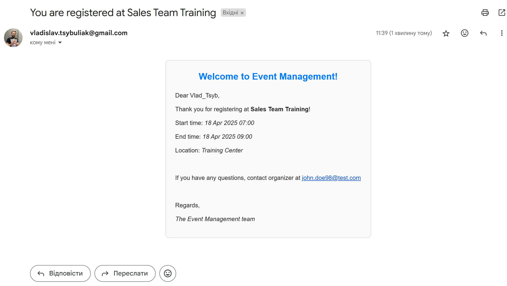
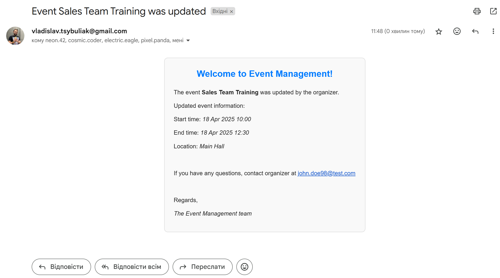
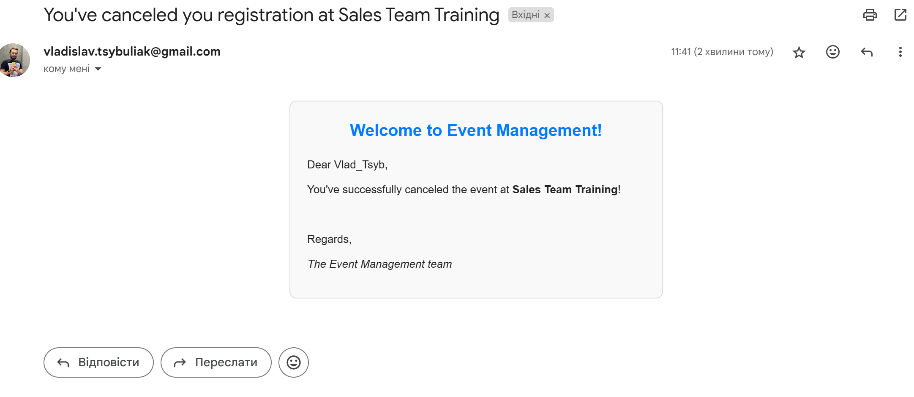

# Event Management API Service

The **Event Management API Service** is a Django Rest Framework project for managing events. It allows users to retrieve, create, update, delete events; register for the events and cancel registration.

## Installing

### Prerequisites

- Python 3.8+
- Install PostgreSQL and create db
- Docker

### Steps to Install Locally

1. **Clone the Repository**:

    ```bash
    git clone https://github.com/vladislav-tsybuliak1/event-management.git
    cd event-management
    ```

2. **Create a Virtual Environment**:

    ```bash
    python3 -m venv venv
    source venv/bin/activate  # On Windows: venv\Scripts\activate
    ```

3. **Install Dependencies**:

    ```bash
    pip install -r requirements.txt
    ```
4. **Create .env file and set up environment variables**:

    For the list of environment variables go to `env.sample`

5. **Run Migrations**:

    ```bash
    python manage.py migrate
    ```
6. **(Optional) Load data to db**:

    ```bash
    python manage.py loaddata events/tests/fixtures/events_data.json
    ```

7. **Create a Superuser.**:

    ```bash
    python manage.py createsuperuser
    ```

8. **Start the Server**:

    ```bash
    python manage.py runserver
    ```

*Note*: you can a use superuser from fixture with `admin@admin.com` and `test123test`

## Run with Docker

### Steps to Run Using Docker

1. **Build the Docker Image**:

    ```bash
    docker-compose build
    ```

2. **Start the Services**:

    ```bash
    docker-compose up
    ```

3. **Access the API**:

    - The API will be available at `http://localhost:8000/`.

## Getting Access

To access endpoints of you don't have an account, register first here:
`api/v1/user/register/`.
If you have an account, receive you token here:
`api/v1/user/token/`.
Use your *access* token to access API endpoints.

### API Endpoints

Here are event API endpoints you can access:

- **Events**:
  - `GET /api/v1/events/` - List all events (all users)
  - `POST /api/v1/events/` - Create a new event (only auth users)
  - `GET /api/v1/events/<id:int>/` - Retrieve event detail info (all users)
  - `PUT /api/v1/events/<id:int>/` - Update event info (only event organizers)
  - `PATCH /api/v1/events/<id:int>/` - Partially update event info (only event organizers)
  - `DELETE /api/v1/events/<id:int>/` - Delete event (only event organizers)
  - `POST /api/v1/events/<id:int>/register/` - Register to the event (only auth users)
  - `POST /api/v1/events/<id:int>/unregister/` - Cancel event registration (only auth users)

To see all the endpoints documentation with possible filters & ordering params, responses and examples go to:

- **Swagger documentation**: `http://localhost:8000/api/v1/doc/swagger/`

To access the admin panel for managing models go to:

- **Admin Panel**: `http://localhost:8000/admin/`

Use the credentials from the superuser created earlier to log in.

## Features

- **Event Management**: Add, view, update, and delete event information
- **Event Registration**: Register for the event and cancel registration
- **Pagination**: Built-in pagination for efficient data retrieval.
- **JWT Authentication**
- **Swagger documentation**
- **Filtering events**: By location, title, starting date, organizer, organized events by user, events user participates in.
- **Ordering events**: By location, title, starting date.
- **Email notifications**: Receive email notifications upon event registration, cancelling registration, any time or location updates.

### Examples of email messages:

#### Example 1: Event Registration


#### Example 2: Event Update


#### Example 3: Event Cancellation


## Tests
Run locally (if you're running locally) or in event_management Docker container (if you're running in Docker)
1. **Test events**:

    ```bash
    python manage.py test events.tests
    ```

2. **Test users**:

    ```bash
    python manage.py test users.tests
    ```

## Contact
For any inquiries, please contact [vladislav.tsybuliak@gmail.com](mailto:vladislav.tsybuliak@gmail.com).
